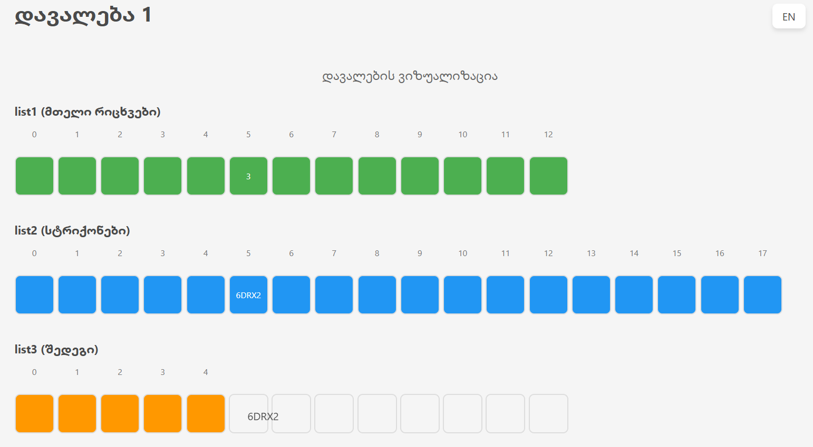

# Task #1 - List Processing Progra

This Java project demonstrates list manipulation using integer-based indexing and safe access techniques.

## Table of Contents

1. [Description](#description)  
2. [Program Logic](#program-logic)  
3. [Expected Output](#expected-output)  
4. [Error Handling](#error-handling) 
5. [Screenshot](#screenshot) 

---

## Description
This Java program processes two lists (`list1` and `list2`) with predefined values and performs specific operations to generate a third list (`list3`).

1. Initializes two lists:
   - `list1`: Contains integer values `[3, 2, 3, 9, 2, 3, 8, 5, 3, 5, 2, 3, 6]`
   - `list2`: Contains string values `["2tpA", "9N60w", "DFw", "mO9g6", "P2WD", "6DRX2", "RTVOb", "RHOY", "Ct2", "KRbtu", "Ym5Yu", "MW9", "5PPzD", "kem1C", "hmWJ", "9XTEQ", "12x", "Qzo8"]`

2. Creates `list3` by:
   - Using values from `list1` to calculate indices for `list2` using formula: `index = integer + (integer - 1)`
   - Gracefully handles index out-of-bounds cases by skipping invalid indices

3. Processes `list3` by:
   - Removing elements at even indexes (0, 2, 4, etc.)

---

## Program Logic

- **Step 1**: Initialize `list1` with a set of integers.
- **Step 2**: Initialize `list2` with a set of strings.
- **Step 3**: For each value `n` in `list1`, calculate an index into `list2` using:
index = n + (n - 1) = 2n - 1
- **Step 4**: Removes elements at even indexes.
- **Step 5**: If the index is valid (within bounds), add the corresponding string from `list2` to `list3`.
- **Step 6**: Print all four lists (both with before removing even indexes and after removing).

---

## Expected Output  

Below is a sample output when running the program with the provided lists:

- `list1 (integers)`: [3, 2, 3, 9, 2, 3, 8, 5, 3, 5, 2, 3, 6]
- `list2 (strings)`: [2tpA, 9N60w, DFw, mO9g6, P2WD, 6DRX2, RTVOb, RHOY, Ct2, KRbtu, Ym5Yu, MW9, 5PPzD, kem1C, hmWJ, 9XTEQ, 12x, Qzo8]
- `list3 (before removing even indexes)`: [6DRX2, mO9g6, 6DRX2, Qzo8, mO9g6, 6DRX2, 9XTEQ, KRbtu, 6DRX2, KRbtu, mO9g6, 6DRX2, MW9]
- `list3 (after removing even indexes)`: [mO9g6, Qzo8, 6DRX2, KRbtu, KRbtu, 6DRX2]

---

## Error Handling

- The program includes bounds checking to avoid IndexOutOfBoundsException.
Warning: Calculated index 17 is out of bounds for list2 (size: 18)
- For any invalid index, it prints a warning message like:
`Warning: Calculated index X is out of bounds for list2 (size: Y)`
- Invalid indices are skipped, ensuring the program runs smoothly even with irregular inputs.

---

## Screenshot
  
*(Example values visible: "6DRX2" from list2 and value 3 from list1)*
